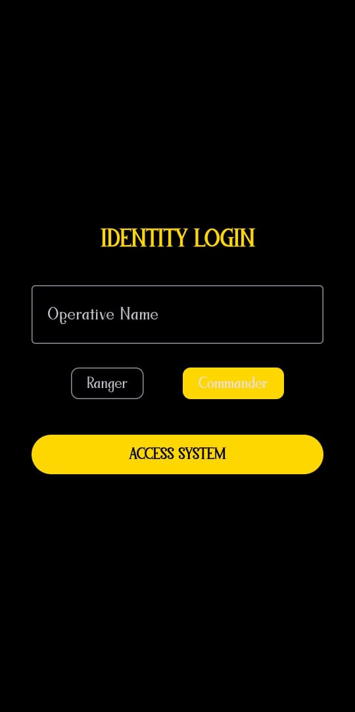
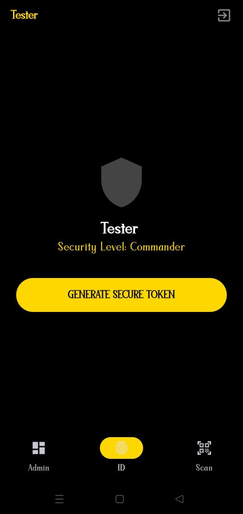
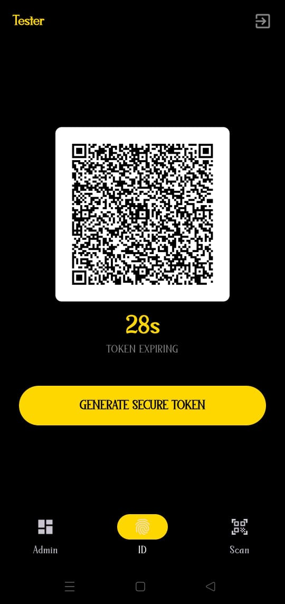
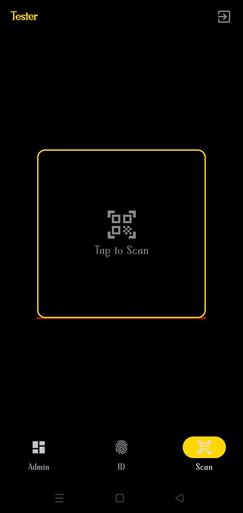
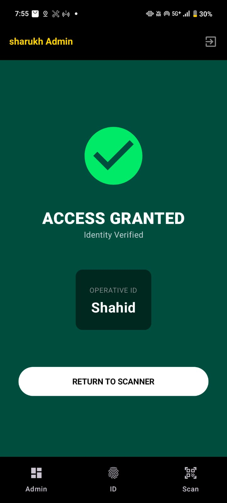
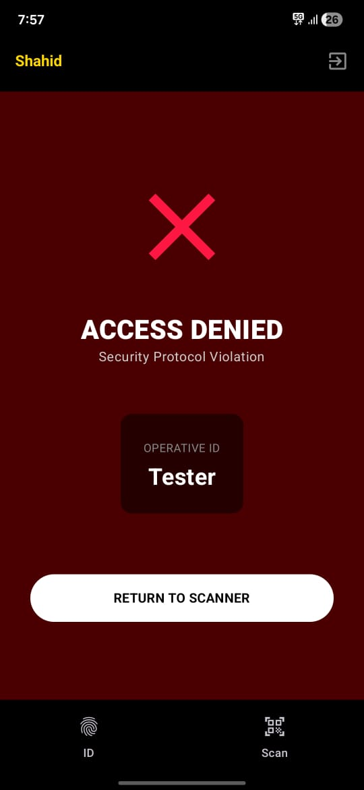
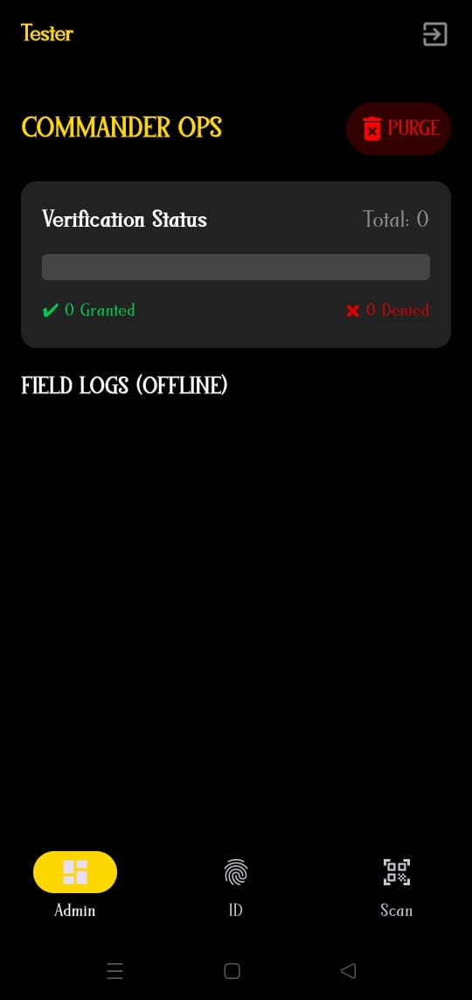
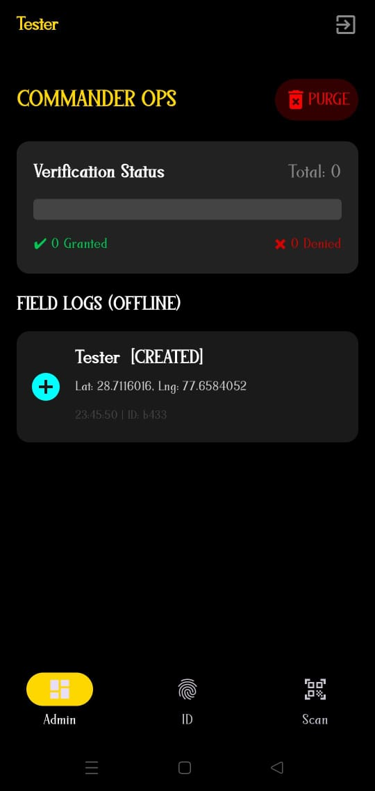
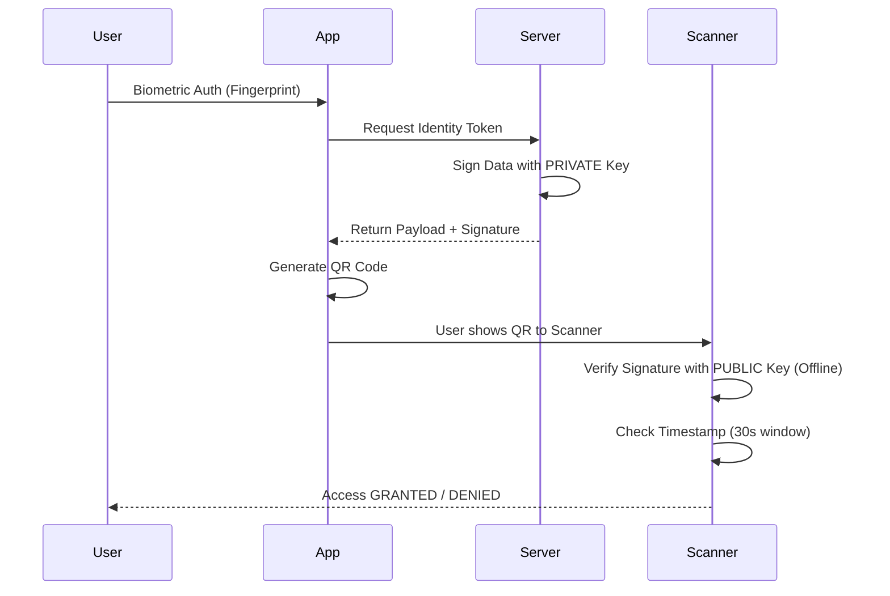

# 🛡️ RangerVault: Zero-Trust Identity System

### Team IdentifAI | NIT Allahabad

> **Problem Statement:** Black Ranger's Identity Vault – QR Verification
>
> **Core Philosophy:** "Trust Code, Not Connectivity." A cryptographically secure, offline-first identity verification system designed for high-security environments.

---

## 📖 Project Overview

**RangerVault** is a military-grade access control application designed to prevent unauthorized entry into secure facilities (The Command Center). Unlike traditional systems that fail without the internet, RangerVault uses **Asymmetric Cryptography (RSA-2048)** to verify identities offline.

The system consists of two parts:
1.  **The Agent App:** Generates a time-sensitive, digitally signed QR code after biometric authentication.
2.  **The Scanner (Gatekeeper):** Verifies the digital signature locally on the device without needing to contact a central server, ensuring zero latency and 100% uptime.

---

## 📸 App Glimpse

### The Agent Flow
| **Identity Login** | **Token Generation** | **Secure QR** |
|:---:|:---:|:---:|
|  |  |  |

<br>

### The Gatekeeper Flow
| **Scanner View** | **Access Granted** | **Access Denied** |
|:---:|:---:|:---:|
|  |  |  |

<br>

### Admin & Logs
| **Commander Dashboard** | **Geo Logs** |
|:---:|:---:|
|  |  |

> **Visual Flow:** Agent Login ➔ Token Generation ➔ Verification Scanning (Granted/Denied) ➔ Live Field Logging
## 🚀 Key Features

* **🔐 Zero-Trust Architecture:** Every scan is treated as hostile until cryptographically proven valid.
* **📡 Offline Verification (The Sentinel):** Uses an embedded Public Key to verify RSA-2048 signatures instantly without internet/database access.
* **⏳ Dynamic Identity (TOTP):** QR codes contain a timestamp and regenerate every 30 seconds to prevent "Replay Attacks" (screenshot forgery).
* **👆 Biometric Wallet:** Integrated with Android `BiometricPrompt` (Fingerprint/FaceID) to ensure the device holder is the authorized agent.
* **🌍 Geo-Fenced Logging:** Automatically logs the GPS coordinates of every scan attempt (Granted or Denied) for audit trails.
* **🖥️ Commander Dashboard:** A web-based admin panel to view real-time entry logs and active agent status when connectivity is available.

---

## 🛠️ Tech Stack

| Component | Technology Used |
| :--- | :--- |
| **Mobile Architecture** | **MVVM (Model-View-ViewModel)**, Clean Architecture |
| **Android Framework** | Kotlin, **Jetpack Compose** (Modern UI) |
| **Scanner/QR** | ZXing (Generation), JourneyApps (Scanning) |
| **Networking** | Retrofit, OkHttp, Gson |
| **Backend** | Node.js, Express.js |
| **Security** | RSA-2048 (Asymmetric), SHA-256 Hashing, Base64 |
| **Hardware Access** | Camera (Scan), Location (FusedLocation), Biometrics |

---

## 🏗️ System Architecture & Workflow


The system relies on a **Public-Private Key Pair**:

1.  **Server (HQ):** Holds the **Private Key**. It receives user data, signs it, and returns a unique `signature`.
2.  **App (Agent):** Displays the `payload + signature` as a QR Code.
3.  **Scanner (Guard):** Holds the **Public Key**. It scans the QR, separates the signature, and mathematically verifies that the payload was indeed signed by HQ and hasn't been tampered with.



## 📂 Folder Structure

We strictly follow the **MVVM** (Model-View-ViewModel) pattern to ensure separation of concerns and maintainability.

```text
com.example.rangervault
│
├── data                  # DATA LAYER (Single Source of Truth)
│   ├── model             # Data Classes (e.g., GeoLogEntry, IdentityRequest)
│   ├── remote            # Retrofit Service & API Interfaces
│   └── repository        # RangerRepository (Handles data logic & storage)
│
├── utils                 # HELPER LAYER
│   ├── CryptoUtils.kt    # OfflineVerifier (RSA Asymmetric Logic)
│   └── QrUtils.kt        # QR Generation & Camera handling
│
├── viewmodel             # STATE LAYER
│   └── RangerViewModel.kt # Manages UI State & Business Logic
│
├── ui                    # UI LAYER (Jetpack Compose)
│   ├── theme             # Custom Dark Theme (Ranger Gold/Black)
│   └── screens           # Individual Composable Screens
│       ├── LockScreen.kt
│       ├── LoginScreen.kt
│       ├── ScannerScreen.kt
│       └── ResultScreen.kt
│
└── MainActivity.kt       # Entry Point & Hardware Linking (Camera, GPS, Biometrics)
```


# 🚨 API Documentation

## 1. Generate Identity Endpoint  
**POST** `/api/generate-identity`

**Purpose:**  
Returns a signed token for the user.

**Body:**
```json
{ 
  "userId": "Agent007", 
  "role": "Ranger", 
  "deviceId": "android_id_123" 
}
```

**Response:**
```json
{
    "payload": "Agent007|Ranger|170123456",
    "signature": "Base64String..."
}
```

## 2. Log Entry Endpoint:
**POST**  `/api/log-entry`

**Purpose:**
Syncs offline scan logs to the server when internet is available.

**Body:** 
```json
{
    "userId": "Agent007",
    "status": "GRANTED",
    "lat": 28.5, "lng": 77.2
}
```

## ⚙️ Setup Instructions
**Prerequisites**
1. Android Studio Ladybug (or newer)
2. Node.js & NPM
3. Physical Android Device (Recommended for Camera/Biometrics)

**Step 1: Backend Setup (The Authority)**
```Bash
cd backend
npm install
# Generate the keys (Critical Step)
node keygen.js
# Start the server
node index.js
```

Note: Copy the content of public.pem generated here into OfflineVerifier.kt in the Android app.

**Step 2: Android App Setup**

1. Open the project in Android Studio.
2. Navigate to `data/remote/NetworkClient.kt`.
3. Update BASE_URL to your laptop's IP address (e.g., http://192.168.1.5:3000) or your deployed URL.
4. Sync Gradle and Run on device.

## 🛡️ Error Handling & Reliability

1. Network Failure: The Scanner verifies signatures locally using the Public Key. No API call is needed to grant access.
2. Cloning Attacks: The QR code includes a deviceId. If the scanned device ID doesn't match the registered ID, access is denied.
3. Replay Attacks: The QR payload includes a timestamp. The scanner rejects any token older than 30 seconds.
4. App Crashes: Used try-catch blocks in Coroutines and safe Retrofit calls to prevent UI crashes during network instabilities.

## 🔮 Future Improvements

1. Blockchain Logging: Store access logs on a private blockchain for immutable audit trails.
2. Face Recognition Server-Side: Add a second layer of verification by sending the face bitmap to the server (when online).
3. WearOS Integration: Allow Rangers to generate codes directly from their smartwatches.

## 👥 Team Members
1. VIBHU TOMER
2. SHARUKH AHAMAD
3. SHAVEZ ALI
4. RITANSHU SINGH
